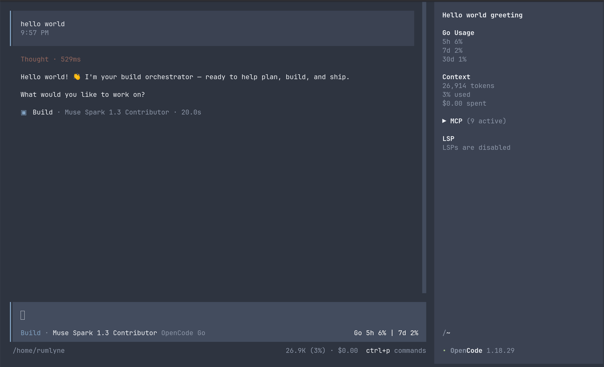
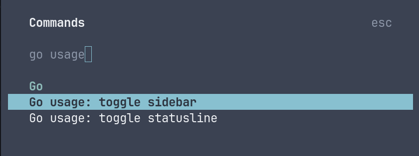

# oc-go-usage-display

[](https://www.npmjs.com/package/oc-go-usage-display)

OpenCode Go subscription usage for [opencode](https://opencode.ai), split into
two independent plugin targets:

| Target | Source | Bundled entry | Surface |
| ------ | ------ | ------------- | ------- |
| server | `src/index.ts` | `dist/plugins/oc-go-usage-display.ts` | `go_usage` tool (`Go 5h 42% (reset 3h12m) \| 7d 15% \| 30d 61%`) |
| tui | `src/tui.tsx` | `dist/plugins/oc-go-usage-display.tsx` | `Go Usage` sidebar block + `session_prompt_right` statusline |

Only those two bundled files are installed; `shared.ts` is inlined at build
time. Requires Node >= 22 and opencode >= 1.18.



## Install (npm)

| Mode | Command |
| ---- | ------- |
| Persistent (recommended) | `npm install oc-go-usage-display@1.2.0 && npx oc-go-usage-display-init --copy` |
| One-shot (npx) | `npx -p oc-go-usage-display@1.2.0 oc-go-usage-display-init --copy` |
| One-shot (bunx) | `bunx -p oc-go-usage-display@1.2.0 oc-go-usage-display-init --copy` |
| Project scope | `npx -p oc-go-usage-display@1.2.0 oc-go-usage-display-init --copy --config-dir .opencode` |

`oc-go-usage-display-init` copies `dist/plugins/*` into
`<config-dir>/plugins/` and registers the `opencode.jsonc` (server) +
`tui.json` (TUI) entries. Restart opencode afterwards. Pin the version
(`@1.2.0`, not `@latest`) so installs stay reproducible. Copy-first installs
require >= 1.2.0: the published 1.1.0 predates them (it symlinks and ignores
`--copy`). No secrets are touched. The package name differs from the bin names,
so one-shot installs must select the package explicitly (`-p <package> <bin>`).

Alternative — no files to copy: declare the versioned package in config and
let opencode resolve it at startup (its own package cache):

```jsonc
// opencode.jsonc — server target (go_usage tool)
{
  "plugin": ["oc-go-usage-display@1.2.0"]
}
```

```jsonc
// tui.json — TUI target (Go Usage sidebar + statusline)
{
  "plugin": [["oc-go-usage-display@1.2.0", { "sidebar": true, "statusline": true }]]
}
```

`--copy` is the default and self-contained, so the installed files keep
working after the package-manager cache is pruned. `--symlink` is dev-only:
it points at the extracted source tree (dangles if that tree moves or the
cache is cleaned), and repo edits apply only after `bun run build` + restart.
Prefer `--copy` for any install you want to keep.

### From a checkout

```sh
./install.sh              # copy install (same as init --copy)
./install.sh --symlink    # dev-only; re-run bun run build after edits
./install-dev.sh          # latest develop dev-tgz + config snapshot/restore
```

## Commands

After `npm install`, the commands are on the package's `bin`; from a checkout
use `node ./bin/<bin>.js` (or `./install.sh`).

| Command | What it does |
| ------- | ------------ |
| `oc-go-usage-display-init` | install (copy) + register entries; `--symlink` for dev |
| `oc-go-usage-display-remove` | uninstall files + config entries (secrets untouched) |
| `oc-go-usage-display-show` | print effective install; `--json` for machine output |
| `oc-go-usage-display-status` | health check; exit 0 healthy, 1 with reasons |
| `oc-go-usage-display-update` | re-install + `git pull --ff-only` when a remote exists |

| Flag | Commands | Meaning |
| ---- | -------- | ------- |
| `--config-dir <path>` | all | install target; default `$OPENCODE_CONFIG_DIR` or `~/.config/opencode` |
| `--repo <path>` | init/show/status/update | source root; defaults to the package/repo root |
| `--copy` | init/update | copy the bundled files (default, self-contained) |
| `--symlink` | init/update | dev-only; points at `dist/plugins/*` (build + restart after edits) |
| `--sidebar=0/1` | init/update | set the `sidebar` toggle (`0/1`, `false/true` accepted) |
| `--statusline=0/1` | init/update | set the `statusline` toggle |
| `--json` | show | JSON report instead of text |

Install-dev flags live in [Development](#development).

## Display toggles

Both surfaces default on and are independent:

```json
{ "plugin": ["./plugins/oc-go-usage-display.tsx", { "sidebar": true, "statusline": true }] }
```



Toggle them from the command palette as `Go usage: toggle sidebar` /
`Go usage: toggle statusline`
(`oc-go-usage-display.toggle-sidebar` / `oc-go-usage-display.toggle-statusline`);
collapse state is persisted per surface. Environment variables and the legacy
`display` option apply only when the `tui.json` toggles are absent. Restart
opencode after changing static config.

## Auth and config

First match wins (secrets are never logged):

| # | Source | Behavior |
| - | ------ | -------- |
| 1 | `OPENCODE_GO_MOCK=1` | deterministic mock snapshot (never cached) |
| 2 | `OPENCODE_GO_API_KEY` | `GET https://opencode.ai/zen/go/v1/usage` with `Authorization: Bearer <key>` |
| 3 | `auth.json` | same Bearer path; `$XDG_DATA_HOME/opencode/auth.json` (default `~/.local/share/opencode/auth.json`), fallback `~/.config/opencode/auth.json`; `opencode-go` key, else `opencode` key |
| 4 | workspace + cookie | scrape `GET https://opencode.ai/workspace/{workspaceId}/go` with `Cookie: auth=<authCookie>`; env vars override the file config |
| 5 | none | unavailable snapshot (`not configured (set OPENCODE_GO_API_KEY)`) |

File config (`~/.config/opencode/oc-go-usage-display.json`):

```jsonc
{
  "workspaceId": "...",
  "authCookie": "..."
}
```

Malformed cookie values (CR/LF, `;`, `,`, tab, NUL, quote) are rejected as
`not configured (malformed auth cookie)`. Successful snapshots are cached 60s
in memory and in `~/.config/opencode/oc-go-usage-display-cache.json`; failures
are never written to the cache.

## Environment variables

| Variable | Used by | Effect |
| -------- | ------- | ------ |
| `OPENCODE_GO_API_KEY` | server + TUI | Bearer key; takes precedence over `auth.json` |
| `OPENCODE_GO_WORKSPACE_ID` | server | workspace id for the cookie scrape; overrides the file config |
| `OPENCODE_GO_AUTH_COOKIE` | server | `auth` cookie value for the scrape; overrides the file config |
| `OPENCODE_GO_MOCK` | server + TUI + tests | `1` returns a deterministic snapshot (bypasses credentials and cache) |
| `OPENCODE_GO_SIDEBAR` | TUI | `0/1/false/true`; overrides `sidebar` when the `tui.json` toggles are absent |
| `OPENCODE_GO_STATUSLINE` | TUI | same for `statusline` |
| `OPENCODE_GO_DISPLAY` | TUI | legacy `sidebar` / `statusline` / `both`; used when the `tui.json` toggles are absent |
| `OPENCODE_CONFIG_DIR` | install CLIs + snapshot script | config dir for install/remove/show/status/update and dev snapshots; the running plugin resolves its config/cache under `~/.config/opencode` regardless |

## Development

```sh
bun install
bun run build     # tsc -> dist/ + esbuild -> dist/plugins/* (self-contained)
bun run check     # typecheck only
```

| Test command | Tier |
| ------------ | ---- |
| `bun run test` | build + READONLY unit tier (host/CI) |
| `bun run test:unit` | pure helper tests + live usage shape check (requires a prior build; skips without `OPENCODE_GO_API_KEY`) |
| `bun run test:docker` | `docker compose run --rm --build test` — authoritative gate: integration + e2e, incl. the real opencode/kilo TUI display checks |
| `bun run test:integration` | container-only: bin CLI, snapshot, `pack` contract, fail-safe, redirect wiring |
| `bun run test:e2e` | container-only: real hosts — `go_usage` registration plus tmux TUI display assertions |

The unit tier is readonly by construction (`scripts/check-unit-purity.mjs`
rejects fs writes, tmp usage, child processes and sockets): no local state is
touched, not even tmp. Integration and e2e tests run only inside the container
image — `docker compose run --rm --build test` bakes the checkout in (no bind
mount) and installs the pinned `opencode`/`kilo` binaries plus tmux. The
devcontainer (`.devcontainer/`) builds the same image with a bind-mounted
workspace.

Container beacons: the load checks are container-only (compose sets
`OC_GO_TEST_CONTAINER=1`) and use the container's disposable `~/.config`,
while the host-runnable TUI display tests redirect HOME/XDG/tmux sockets into
temp dirs — a local `bun run test:e2e` never reads or writes the developer's
real `~/.config/opencode`.

### Dev install from CI

`./install-dev.sh` requires an authenticated `gh`, node, and npm. It resolves
the latest successful `dev-build.yml` run on `develop` (or `--run-id`),
downloads the `dev-tgz` artifact into `./tmp-dev`, snapshots the six OpenCode
config paths (see below), installs the tarball with `npm install --no-save`,
and runs `oc-go-usage-display-init --copy`. There is **no auto-restore**: the
snapshot path, the restore command, and the published fallback are printed.

Useful flags: `--dry-run` (download + tarball sanity check only), `--branch`
(default `develop`), `--workflow` (default `dev-build.yml`), `--run-id`,
`--dir`, `--force`/`--clean`, `--config-dir`, `--backup-dir`, `--sidebar`,
`--statusline`.

```sh
# Restore the config that existed before the dev install
scripts/dev-config-snapshot.sh restore --backup-dir <snapshot path>

# Or go back to the published version (copy-first needs >= 1.2.0)
npx -y -p oc-go-usage-display@latest oc-go-usage-display-init --copy
```

Snapshotted paths: `opencode.jsonc`, `tui.json`,
`plugins/oc-go-usage-display.ts`, `plugins/oc-go-usage-display.tsx`,
`oc-go-usage-display.json`, `oc-go-usage-display-cache.json` (plus
`--config-dir` for project scopes).

## CI

| Workflow | Trigger | Jobs |
| -------- | ------- | ---- |
| `test.yml` | push, pull_request, weekly (Mon 06:00 UTC) | `unit` (typecheck + build + readonly tests, incl. live usage shape when the key is set), `container-e2e` (`docker compose run --rm --build test`: integration + real TUI display checks) |
| `dev-build.yml` | push to `develop`, manual | builds + readonly unit tests, packs `dev-tgz` artifact (90 days) |
| `publish.yml` | push to `main`, tag `v*`, manual | containerized test gate, conventional-commit version bump, OIDC provenance publish |

## Troubleshooting

### Plugin didn't load

Check the install first: `npx oc-go-usage-display-show` reports file state,
entries, and toggles; `npx oc-go-usage-display-status` exits non-zero with the
reason. Restart opencode after installing or changing `tui.json` /
`opencode.jsonc` (config loads once). `opencode debug config` shows the
resolved `plugin` list and `plugin_origins`. `opencode --pure`
(`OPENCODE_PURE=1`) skips external plugins entirely — it is not a valid check
when the plugin under test is this one. Copy installs do not break when the
repo/package changes; re-run init to refresh (see [Stale install](#stale-install)).

### No API key or no subscription

The plugin stays fail-safe and shows a literal reason instead of breaking
opencode: `go_usage` and the sidebar render `Go n/a (...)` and the statusline
hides itself. Set `OPENCODE_GO_API_KEY`, sign in through the `opencode-go`
provider (so `auth.json` supplies the key), or configure workspace + cookie.
Reasons visible in the `go_usage` JSON include
`not configured (set OPENCODE_GO_API_KEY)`, `API key rejected (401/403)`,
`no OpenCode Go subscription`, and
`login expired (refresh auth cookie)`.

### Stale install

Copy installs never auto-update. After upgrading the package or pulling the
repo, re-run `npx oc-go-usage-display-init --copy` (or
`oc-go-usage-display-update`), then restart opencode. `show`/`status` report a
copy that differs from the repo as a note, never a failure.

### Restore after a dev install

`./install-dev.sh` takes a snapshot before touching anything and prints a
restore command. Run it yourself when done:

```sh
scripts/dev-config-snapshot.sh restore --backup-dir <snapshot path>
```

Add `--config-dir <path>` if the dev install was project-scoped. To return to
the published package instead, run the fallback printed by the script (see
[Dev install](#dev-install-from-ci)).

### opencode starts but no sidebar

The sidebar comes from the TUI target, so `tui.json` must contain the plugin
entry with `"sidebar": true` (check with `npx oc-go-usage-display-show`). The
block only renders inside a session route, and the command palette toggle
(`Go usage: toggle sidebar`) persists a collapsed state. `OPENCODE_GO_SIDEBAR=0`
or `OPENCODE_GO_DISPLAY=statusline` also hides it; restart after changing
static config. No credentials means the block shows `Go n/a (…)` instead of
usage rows.

## Uninstall

```sh
npx oc-go-usage-display-remove
npm uninstall oc-go-usage-display
```

From a checkout: `node ./bin/oc-go-usage-display-remove.js`. This removes the
plugin files and the `opencode.jsonc` (server) + `tui.json` (TUI) entries
(`--config-dir` / `OPENCODE_CONFIG_DIR` supported). Secrets are never touched:
env vars, `auth.json`, and `oc-go-usage-display.json` stay in place — delete
them by hand if desired. Restart opencode afterwards.

Entries are managed as JSON; existing comments in
`opencode.jsonc`/`tui.json` may be normalized to plain JSON on write. No-op
removals skip the write so comments are preserved when nothing changes.

Manual file list (global scope, bundled self-contained — no shared file):

- `~/.config/opencode/plugins/oc-go-usage-display.ts`
- `~/.config/opencode/plugins/oc-go-usage-display.tsx`
- server entry (`./plugins/oc-go-usage-display.ts`) in `~/.config/opencode/opencode.jsonc`
- TUI entry (`./plugins/oc-go-usage-display.tsx`) in `~/.config/opencode/tui.json`